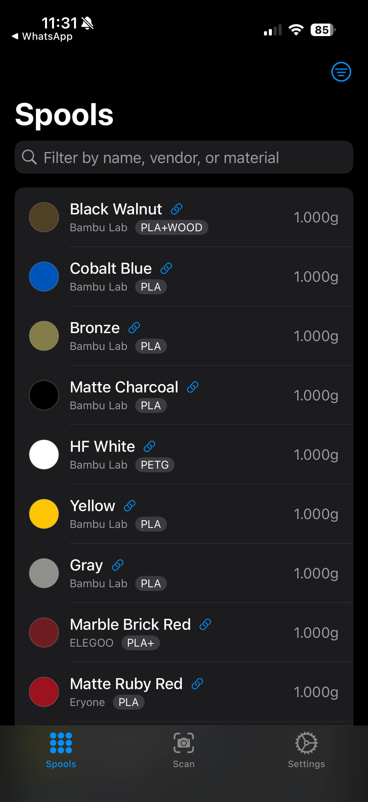
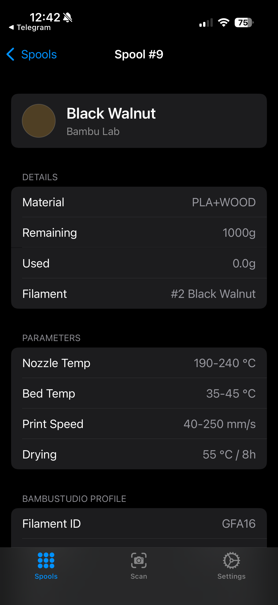
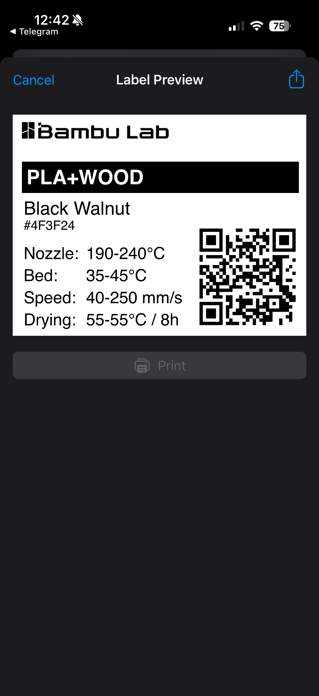

# SpoolBrowser

iOS app for browsing [Spoolman](https://github.com/Donkie/Spoolman) filament spools with BambuStudio and BLE label printer integration.

## Features

- Browse spools and filaments from a Spoolman server
- Link BambuStudio filament profiles to Spoolman filaments via [SpoolHelper](#related)
- Set active filament in BambuStudio by activating profiles through SpoolHelper
- Print physical spool labels on a Phomemo M110 thermal label printer via Bluetooth
- Write spool URLs to NFC tags and scan them to jump to spool details
- Scan QR codes to look up spools
- Deep link support for `spoolbrowser://` and `spoolman://` URL schemes

<p align="center">
  
  
  
</p>

## Branches

The `no-rfid` branch removes all NFC tag reading/writing features. Use this branch if you don't have a paid Apple Developer Program membership, since the NFC entitlement requires one.

## Requirements

- iOS 18.0+
- A running [Spoolman](https://github.com/Donkie/Spoolman) server instance
- [SpoolHelper](../spool-helper/) macOS companion app (optional, for BambuStudio profile integration)
- Phomemo M110 label printer (optional, for physical label printing)

## Building

The project uses [XcodeGen](https://github.com/yonaskolb/XcodeGen) to generate the Xcode project from `project.yml`.

```bash
xcodegen generate
xcodebuild build -scheme SpoolBrowser -destination 'platform=iOS Simulator,name=iPhone 16'
xcodebuild test -scheme SpoolBrowser -destination 'platform=iOS Simulator,name=iPhone 16'
```

To sign the app for a physical device, copy the example config and set your Apple Development Team ID:

```bash
cp Local.xcconfig.example Local.xcconfig
# Edit Local.xcconfig and replace YOUR_TEAM_ID_HERE with your team ID
xcodegen generate
```

`Local.xcconfig` is gitignored and won't be committed.

## Label Printing

SpoolBrowser can print spool information labels on Phomemo M110 thermal label printers over Bluetooth Low Energy. Labels include the vendor logo, material type, color name, printing parameters (nozzle/bed temps, speed, drying), and a QR code linking back to the spool in Spoolman.

The label format, layout, and vendor logos are based on [3dfilamentprofiles.com](https://3dfilamentprofiles.com) by [Mark's Maker Space](https://github.com/MarksMakerSpace/filament-profiles).

## URL Schemes

SpoolBrowser registers two URL schemes: `spoolbrowser://` and `spoolman://`.

| URL | Action |
|---|---|
| `spoolbrowser://spool/{id}` | Open spool detail view |
| `spoolbrowser://filament/{id}` | Open filament detail view |

## Spoolman Extra Fields

BambuStudio profile data is stored as custom extra fields on Spoolman filaments:

| Key | Type | Format | Example |
|---|---|---|---|
| `ams_filament_id` | text | JSON-quoted string | `"GFSA00"` |
| `ams_filament_type` | text | JSON-quoted string | `"PLA"` |
| `nozzle_temp` | integer_range | `[min, max]` | `[190, 230]` |
| `bed_temp` | integer_range | `[min, max]` | `[55, 65]` |
| `drying_temperature` | integer_range | `[min, max]` | `[40, 55]` |
| `drying_time` | integer | plain number | `8` |
| `printing_speed` | integer_range | `[min, max]` | `[40, 100]` |

Text fields are JSON-encoded -- the raw stored value for `"GFSA00"` is `"\"GFSA00\""`. Missing fields are created automatically via `POST /api/v1/field/filament/{key}`.

## Credits

- Vendor logos and label format: [3dfilamentprofiles.com](https://3dfilamentprofiles.com) by [Mark's Maker Space](https://github.com/MarksMakerSpace/filament-profiles)

## Disclaimer

This project was built almost entirely through agentic programming using [Claude Code](https://claude.ai/code). The architecture, implementation, and tests were generated through AI-assisted development with human guidance and review.

## Related

[SpoolHelper](../spool-helper/) -- macOS menu bar companion app that reads BambuStudio filament profiles and exposes them over HTTP for SpoolBrowser to use.
